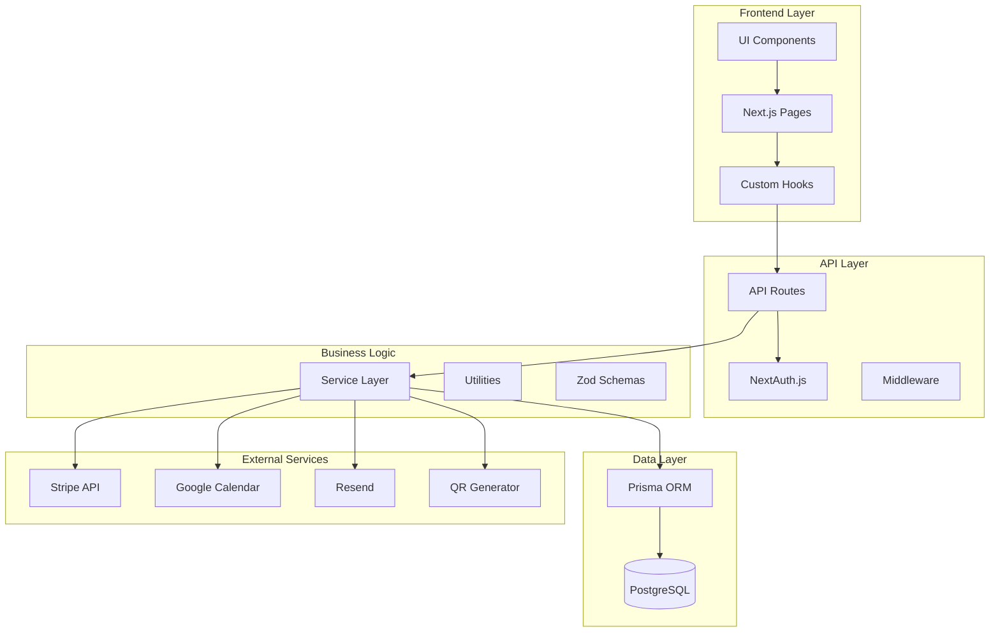
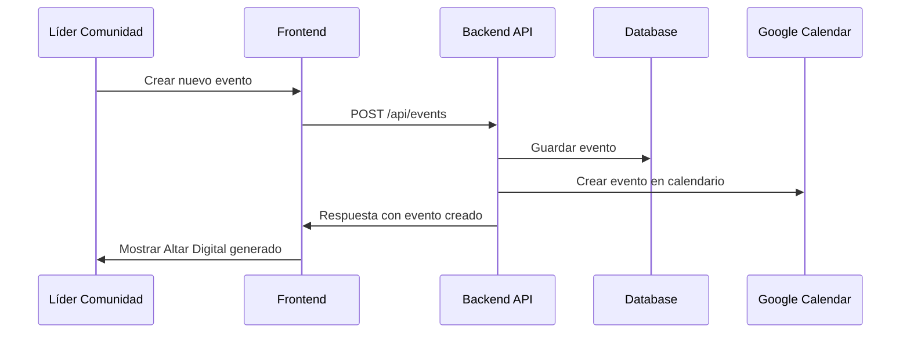
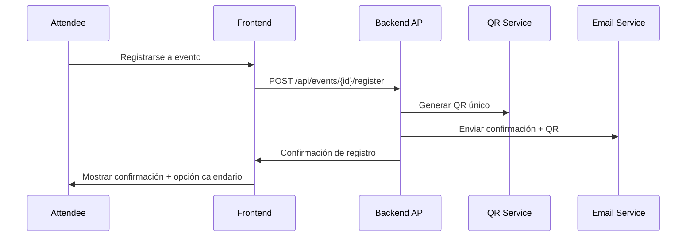
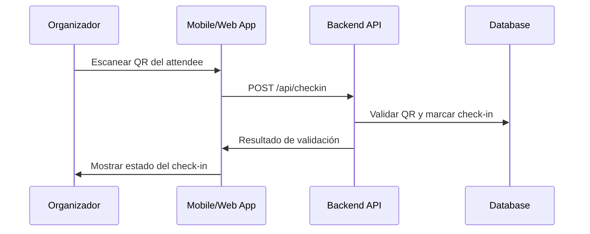
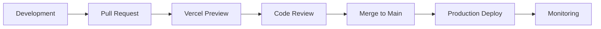

# Documento de Diseño - Tech-Ofrenda MVP

## Visión General

Tech-Ofrenda es una plataforma web moderna de gestión de eventos comunitarios que combina un CMS intuitivo con funcionalidades de fondeo y gestión multi-ciudad. La arquitectura está diseñada para ser escalable, mantenible y proporcionar una experiencia de usuario fluida tanto para organizadores como para participantes.

### Objetivos del Diseño

- **Escalabilidad Multi-Ciudad**: Arquitectura que soporte múltiples User Groups independientes
- **Experiencia de Usuario Moderna**: Interfaz responsiva con temática del Día de Muertos
- **Gestión Integral de Eventos**: Desde creación hasta check-in con QR
- **Integración con Servicios Externos**: Google Calendar, sistemas de pago, generación de QR
- **Seguridad y Permisos**: Sistema robusto de autenticación y autorización por roles

## Arquitectura

### Stack Tecnológico Propuesto

**Frontend:**
- **Next.js 14** con App Router para SSR/SSG y mejor SEO
- **TypeScript** para type safety y mejor experiencia de desarrollo
- **Tailwind CSS** para styling rápido y consistente
- **DaisyUI** para componentes UI modernos y accesibles
- **React Hook Form** + **Zod** para validación de formularios

**Backend:**
- **Next.js API Routes** para endpoints RESTful
- **Prisma ORM** para gestión de base de datos type-safe
- **PostgreSQL** como base de datos principal
- **NextAuth.js** para autenticación multi-proveedor

**Servicios Externos:**
- **Vercel** para deployment y hosting
- **Stripe** para procesamiento de pagos (Ofrendas Digitales)
- **Google Calendar API** para integración de calendario
- **QR Code Generator** para tickets
- **Resend** para envío de emails

### Arquitectura de Componentes



## Componentes y Interfaces

### Modelo de Datos Principal

```typescript
// Esquema Prisma simplificado
model UserGroup {
  id          String   @id @default(cuid())
  name        String
  city        String   @unique
  leaderId    String   @unique
  leader      User     @relation("UserGroupLeader", fields: [leaderId], references: [id])
  events      Event[]
  createdAt   DateTime @default(now())
  updatedAt   DateTime @updatedAt
}

model User {
  id            String    @id @default(cuid())
  email         String    @unique
  name          String
  role          UserRole
  userGroupId   String?
  userGroup     UserGroup? @relation(fields: [userGroupId], references: [id])
  ledUserGroup  UserGroup? @relation("UserGroupLeader")
  // ... otros campos
}

model Event {
  id            String      @id @default(cuid())
  title         String
  description   String
  date          DateTime
  location      String
  capacity      Int
  userGroupId   String
  userGroup     UserGroup   @relation(fields: [userGroupId], references: [id])
  attendees     Attendee[]
  speakers      Speaker[]
  sponsors      Sponsor[]
  // ... otros campos
}

model Attendee {
  id        String   @id @default(cuid())
  userId    String
  eventId   String
  qrCode    String   @unique
  checkedIn Boolean  @default(false)
  // ... otros campos
}
```

### Interfaces de Componentes Principales

#### 1. Dashboard del Líder de Comunidad
```typescript
interface CommunityLeaderDashboard {
  userGroup: UserGroup
  upcomingEvents: Event[]
  totalFunding: number
  attendeeStats: AttendeeStats
  recentContributions: Contribution[]
}
```

#### 2. Altar Digital (Página del Evento)
```typescript
interface AltarDigital {
  event: EventDetails
  speakers: Speaker[]
  sponsors: Sponsor[]
  contributions: Contribution[]
  fundingProgress: FundingProgress
  registrationForm: RegistrationForm
}
```

#### 3. Sistema de Tickets QR
```typescript
interface QRTicketSystem {
  generateTicket(attendeeId: string): Promise<QRTicket>
  validateTicket(qrCode: string): Promise<ValidationResult>
  processCheckIn(qrCode: string): Promise<CheckInResult>
}
```

## Flujos de Usuario Principales

### 1. Flujo de Creación de Evento



### 2. Flujo de Registro de Attendee



### 3. Flujo de Check-in con QR



## Módulos del Sistema

### 1. Módulo de Autenticación y Autorización
- **NextAuth.js** con proveedores múltiples (Google, GitHub, Email)
- **Middleware de autorización** basado en roles y User Groups
- **Gestión de sesiones** seguras

### 2. Módulo de Gestión de User Groups
- **CRUD de User Groups** con validación de ciudad única
- **Asignación de Líderes** con restricción de un líder por grupo
- **Dashboard específico** por User Group

### 3. Módulo CMS de Eventos
- **Editor WYSIWYG** para descripciones de eventos
- **Gestión de multimedia** (imágenes, documentos)
- **Plantillas de eventos** reutilizables
- **Programación y publicación** automática

### 4. Módulo de Fondeo (Ofrendas Digitales)
- **Integración con Stripe** para pagos seguros
- **Contribuciones en especie** con seguimiento manual
- **Dashboard de fondeo** con métricas en tiempo real
- **Reconocimiento público** de patrocinadores

### 5. Módulo de Gestión de Participantes
- **Registro de Attendees** con validación de capacidad
- **Sistema de invitaciones** para Speakers
- **Gestión de Colaboradores** con roles específicos
- **Comunicación automatizada** via email

### 6. Módulo de Tickets QR
- **Generación automática** de QR únicos
- **Validación en tiempo real** durante check-in
- **Estadísticas de asistencia** por evento
- **Exportación de datos** para análisis

## Manejo de Errores

### Estrategia de Error Handling

1. **Validación en el Frontend**: Zod schemas para validación inmediata
2. **API Error Responses**: Códigos HTTP estándar con mensajes descriptivos
3. **Logging Centralizado**: Winston para logs estructurados
4. **Fallbacks Graceful**: UI que maneja estados de error elegantemente
5. **Retry Logic**: Para operaciones críticas como pagos y emails

### Códigos de Error Específicos

```typescript
enum TechOfrendaErrorCodes {
  USER_GROUP_CITY_EXISTS = 'USER_GROUP_CITY_EXISTS',
  EVENT_CAPACITY_EXCEEDED = 'EVENT_CAPACITY_EXCEEDED',
  INVALID_QR_CODE = 'INVALID_QR_CODE',
  PAYMENT_PROCESSING_FAILED = 'PAYMENT_PROCESSING_FAILED',
  UNAUTHORIZED_USER_GROUP_ACCESS = 'UNAUTHORIZED_USER_GROUP_ACCESS'
}
```

## Estrategia de Testing

### Niveles de Testing

1. **Unit Tests**: Jest + Testing Library para componentes y utilidades
2. **Integration Tests**: API routes con base de datos de prueba
3. **E2E Tests**: Playwright para flujos críticos de usuario
4. **Visual Regression**: Chromatic para componentes UI

### Casos de Prueba Críticos

- **Autenticación y autorización** por roles
- **Creación y gestión** de eventos
- **Proceso de registro** y generación de QR
- **Check-in con validación** de QR
- **Procesamiento de pagos** (Stripe en modo test)
- **Integración con Google Calendar**

## Consideraciones de Seguridad

### Medidas de Seguridad Implementadas

1. **Autenticación Robusta**: NextAuth.js con múltiples proveedores
2. **Autorización Granular**: Middleware que valida permisos por User Group
3. **Validación de Datos**: Zod schemas en frontend y backend
4. **Sanitización**: Prevención de XSS en contenido generado por usuarios
5. **Rate Limiting**: Protección contra ataques de fuerza bruta
6. **HTTPS Obligatorio**: Certificados SSL en producción
7. **Secrets Management**: Variables de entorno para API keys

### Compliance y Privacidad

- **GDPR Compliance**: Consentimiento explícito para datos personales
- **Data Retention**: Políticas claras de retención de datos
- **Audit Logs**: Registro de acciones sensibles para auditoría

## Performance y Optimización

### Estrategias de Optimización

1. **SSG/ISR**: Páginas estáticas para eventos públicos
2. **Image Optimization**: Next.js Image component con lazy loading
3. **Database Indexing**: Índices optimizados en PostgreSQL
4. **Caching Strategy**: Redis para sesiones y datos frecuentes
5. **CDN**: Vercel Edge Network para assets estáticos
6. **Bundle Optimization**: Code splitting y tree shaking

### Métricas de Performance Objetivo

- **First Contentful Paint**: < 1.5s
- **Largest Contentful Paint**: < 2.5s
- **Time to Interactive**: < 3.5s
- **Cumulative Layout Shift**: < 0.1

## Deployment y DevOps

### Pipeline de Deployment



### Ambientes

1. **Development**: Local con Docker Compose
2. **Preview**: Vercel preview deployments por PR
3. **Staging**: Ambiente de pruebas con datos sintéticos
4. **Production**: Vercel con PostgreSQL en Supabase

### Monitoreo

- **Application Monitoring**: Vercel Analytics + Sentry
- **Database Monitoring**: Supabase dashboard
- **Uptime Monitoring**: Vercel cron jobs para health checks
- **Performance Monitoring**: Web Vitals tracking